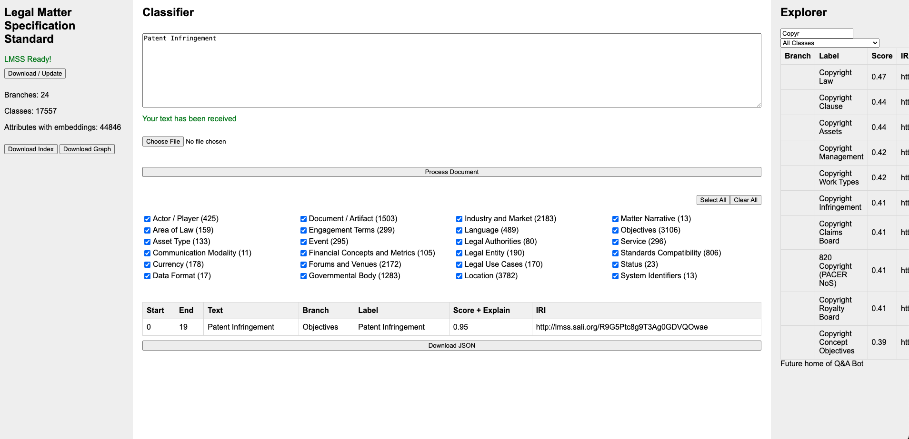

# SALI-E - Legal Matter Specification Standard Entity Extractor



## Project Overview

SALI-E is a powerful tool designed to apply the Legal Matter Standards Specification (LMSS) ontology to text documents. It uses advanced Natural Language Processing (NLP) and Named-Entity Recognition (NER) techniques to extract and classify relevant legal entities and concepts.

## Features

- LMSS ontology management (download, update, and explore)
- Document processing (text input and file upload)
- Entity extraction and classification based on LMSS
- Interactive LMSS class selection for classification
- Search functionality within the LMSS ontology
- User-friendly web interface

## Quick Start

### Cloning the Repository

1. **Clone the repository**:

For the latest version, clone the feature-branch.

```bash
git clone -b feature-branch https://github.com/JustlyAI/lmss_entity_recognizer.git
```

**Option to Download Large Data Files**

To run this application, you’ll need to download LMSS ontology and generate embeddings. To bypass this porcess and download the data assets needed for extraction and classification, follow these steps:

    1.	Visit the latest release on GitHub (https://github.com/JustlyAI/lmss_entity_recognizer/releases/tag/v.0.0.2).
    2.	Download the large data files provided in the release assets.
    3.	Place the downloaded files into the lmss folder within the application directory.

2. **Navigate to the project directory**:

   ```bash
   cd lmss_entity_recognizer
   ```

### Running Directly

1. **Install dependencies**:

   ```bash
   pip install -r requirements.txt
   ```

2. **Download required language models**:

   ```bash
   python -m spacy download en_core_web_sm
   ```

   Optionally, for improved performance:

   ```bash
   python -m spacy download en_core_web_trf
   ```

3. **Run the application**:

   ```bash
   uvicorn app.main:app --host 0.0.0.0 --port 8000 --reload
   ```

4. **Access the application**:
   Open your browser and go to [http://localhost:8000/](http://localhost:8000/)

### Running with Docker

1. **Build and run the Docker container**:

   ```bash
   docker compose up --build
   ```

2. **Access the application**:
   Open your browser and go to [http://localhost:8000/](http://localhost:8000/)

## Additional Information

- API documentation is available at [http://localhost:8000/docs](http://localhost:8000/docs)
- Ensure you have Docker installed on your machine for containerized deployment.
- For direct running, ensure you have Python 3.10+ and pip installed.

## Project Structure

```
sali-e/
├── app/
│   ├── main.py
│   ├── lmss_parser.py
│   ├── lmss_classification.py
│   ├── lmss_search.py
│   ├── entity_extraction.py
│   ├── static/
│   │   └── js/
│   │       └── main.js
│   ├── templates/
│   │   └── index.html
│   ├── lmss/
│   │   ├── LMSS.owl
│   │   ├── lmss_index.json
│   │   ├── lmss_graph.ttl
│   │   ├── lmss_hash.txt
│   │   ├── top_classes.json
│   │   └── lmss_stats.json
├── requirements.txt
├── Dockerfile
├── docker-compose.yml
└── README.md
```

## Usage

1. **LMSS Management**:

   - Use the "Download / Update" button to fetch the latest LMSS ontology.
   - View LMSS statistics and download the index or graph files.

2. **Document Processing**:

   - Enter text directly or upload a file (.txt, .pdf, .docx) for processing.
   - Select relevant LMSS classes for classification.
   - Click "Process Document" to extract and classify entities.

3. **Search and Exploration**:

   - Use the search bar in the Explorer panel to search within the LMSS ontology.
   - Filter search results by class using the dropdown menu.

4. **Results**:
   - View classification results in the table format.
   - Download results as JSON for further analysis.

## Development Notes

- The project uses FastAPI for the backend and vanilla JavaScript for the frontend.
- Entity extraction utilizes spaCy for NLP tasks.
- Sentence transformers are used for generating embeddings.
- The LMSS ontology is parsed and stored using RDFlib.

## Future Enhancements

- Implement visualization features for classification results
- Enhance performance for large documents and ontologies
- Add more sophisticated handling for specific entity types (e.g., locations)
- Develop Q&A Bot functionality in the Explorer panel

## Contributing

This project is currently for internal use. Please contact the project maintainers for information about contributing.
