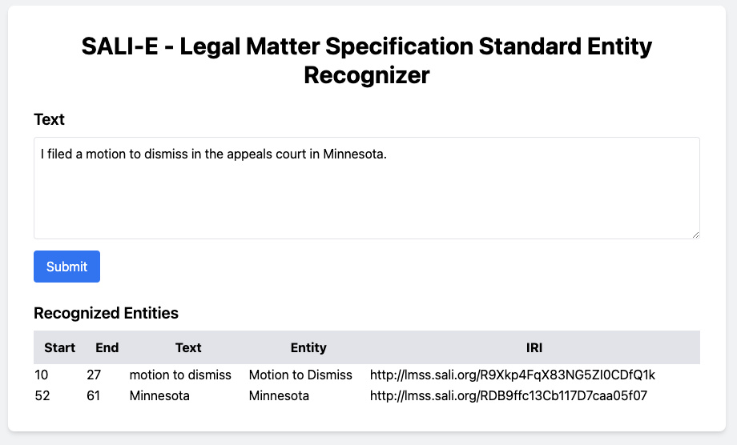

# SALI-E - Legal Matter Specification Standard Entity Recognizer

**This README is not in step with feature-branch**



## Quick Start

## Cloning the Repository

To get started with the SALI-E - Legal Matter Specification Standard Entity Recognizer, you need to clone the repository from GitHub. Follow the steps below:

1. **Clone the repository**:

   ```bash
   git clone https://github.com/JustlyAI/lmss_entity_recognizer.git
   ```

2. **Navigate to the project directory**:

   ```bash
   cd lmss_entity_recognizer
   ```

### Running Directly

1. **Install dependencies**:

   ```bash
   pip install -r requirements.txt
   ```

2. **Run the application**:

   ```bash
   uvicorn app.main:app --host 0.0.0.0 --port 8000 --reload
   ```

3. **Access the application**:
   Open your browser and go to [http://localhost:8000/](http://localhost:8000/)

### Running with Docker

1. **Build and run the Docker container**:

   ```bash
   docker compose up --build
   ```

2. **Access the application**:
   Open your browser and go to [http://localhost:8000/](http://localhost:8000/)

## Additional Information

- Inspect endpoints at [http://localhost:8000/docs](http://localhost:8000/docs)
- Ensure you have Docker installed on your machine.
- For direct running, ensure you have Python and pip installed.

python -m spacy download en_core_web_sm

python -m spacy download en_core_web_trf (alt optional)

What other downloads are useful

Make embedding avialable (bulk upload)
